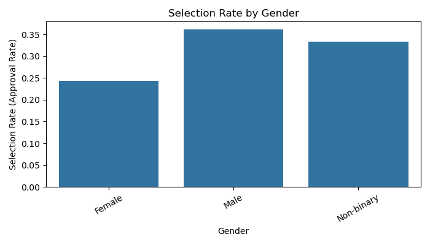
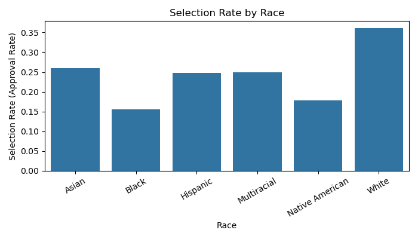
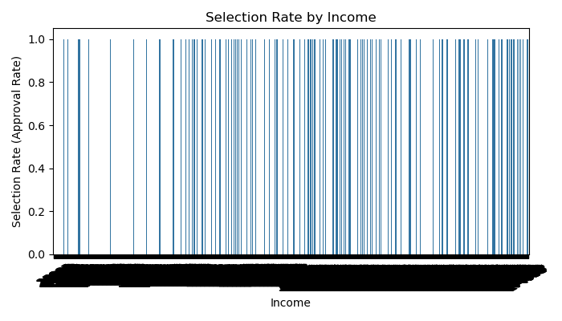
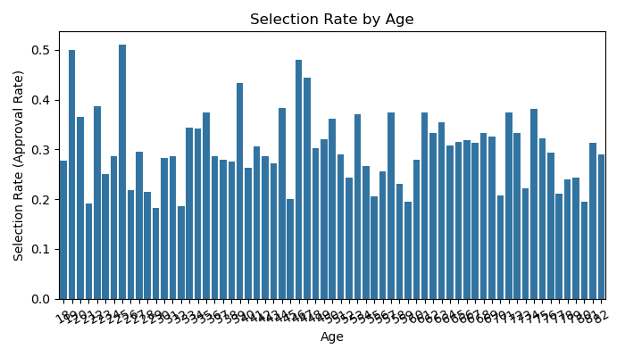
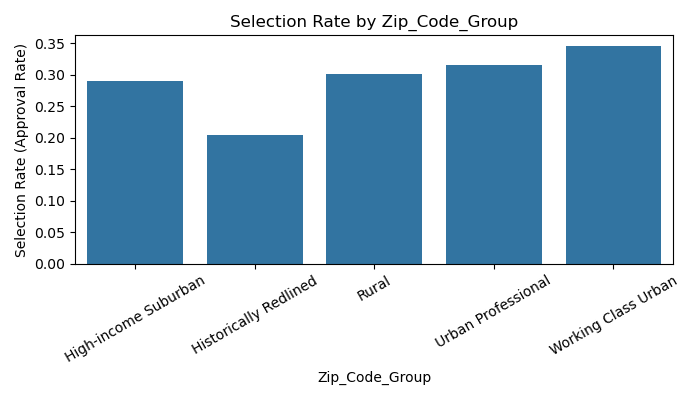

# AI Risk Report

**Filename:** ai_risk_report
**Project Title:** Fair Loan Approval Model

---

## 1. Problem Overview

- **Task:** Predict loan approval using a real-world mortgage dataset.
- **Importance:** Loan approval decisions have significant impacts on individuals’ financial opportunities. Ensuring fairness is crucial to prevent discrimination against protected groups (e.g., by gender, race, income, age, or location).
- **Dataset:** The dataset included features such as Gender, Race, Age, Income, and Zip_Code_Group, which are known sensitive attributes relevant to fairness and bias analysis.

---

## 2. Model Summary

- **Model Used:**  
  - Random Forest Classifier (with class balancing and hyperparameter tuning)
- **Preprocessing & Feature Engineering:**  
  - One-hot encoding for categorical variables  
  - Feature: Income-to-loan ratio  
  - SMOTE for class balancing  
  - Dropped redundant columns (e.g., ID, Age_Group)
- **Performance:**  
  - *Accuracy:* 0.66  
  - *Precision:* 0.66  
  - *Recall:* 0.66  
  - *F1 Score:* 0.66  
  *(All metrics from validation set; see script output for details)*

---

## 3. Bias Detection Process

- **Methods Used:**  
  - Grouped approval rates and disparity analysis  
  - Fairlearn metrics: Demographic Parity Difference, Equalized Odds Difference  
  - Grouped accuracy and recall  
  - Visualizations of selection rate, accuracy, and recall by group
- **Audit Scope:**  
  - Audited both model output and group-level outcomes  
  - Focused on group-level fairness (e.g., by Gender, Race, Income, Age, Zip_Code_Group)

---

## 4. 📉 Identified Bias Patterns

| Bias Type                | Affected Group      | Evidence/Metric                        | Value/Chart         | Comment                        |
|--------------------------|--------------------|----------------------------------------|---------------------|--------------------------------|
| Approval Rate Disparity  | Gender             | Selection rate by Gender               | Female: 0.24, Male: 0.36, Non-binary: 0.33 | Males approved at higher rate  |
| Approval Rate Disparity  | Race               | Selection rate by Race                 | Black: 0.16, White: 0.36, Asian: 0.26, etc. | Black and Native American groups have lowest approval rates |
| Demographic Parity Diff  | Race               | Demographic parity difference (Race)   | 0.205               | Notable gap between groups     |
| Demographic Parity Diff  | Income             | Demographic parity difference (Income) | 1.000               | Extreme disparity by income    |
| Approval Rate Disparity  | Zip_Code_Group     | Selection rate by Zip_Code_Group       | Redlined: 0.20, Suburban: 0.29, Urban: 0.31–0.34 | Historically Redlined areas disadvantaged |
| Approval Rate Disparity  | Age                | Selection rate by Age                  | Range: 0.19–0.50    | Younger and older applicants less likely to be approved |

---

## 5. Visual Evidence

- See attached charts:
  - `charts/selection_rate_by_Gender.png`
  
  - `charts/selection_rate_by_Race.png`
  
  - `charts/selection_rate_by_Income.png`
  
  - `charts/selection_rate_by_Age.png`
  
  - `charts/selection_rate_by_Zip_Code_Group.png`
  

---

## 6. Real-World Implications

- **At Risk:**  
  - Black, Native American, and low-income applicants are much less likely to be approved.
  - Residents of historically redlined areas are also disadvantaged.
- **Ethical/Social Consequences:**  
  - Perpetuates existing inequalities  
  - May violate anti-discrimination laws  
  - Erodes trust in automated decision systems
- **Fairness Audit:**  
  - Based on current metrics, the model may not pass a strict regulatory fairness audit without further mitigation.

---

## 7. Limitations & Reflections

- **What didn’t work:**  
  - Some fairness metrics remain suboptimal despite class balancing and feature engineering.
  - Demographic parity difference for income is extremely high, indicating the model is highly sensitive to income.
- **Next Steps:**  
  - Try additional fairness mitigation (e.g., reweighting, post-processing)  
  - Explore more interpretable models or explainability tools (e.g., SHAP)
- **Lessons Learned:**  
  - Fairness auditing is essential and non-trivial  
  - Group-level metrics can mask individual-level unfairness  
  - Continuous monitoring and improvement are needed
